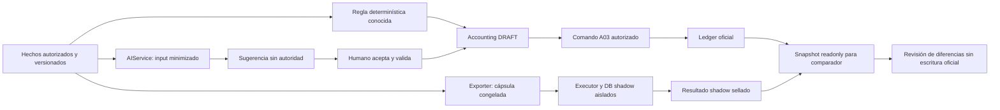

# Accounting: plantillas, automatización, sugerencias IA y shadow

Owner: Accounting. Extiende [arquitectura](architecture.md), [M07](../specs/milestones/accounting-deep.md), [política TILMUX](tilmux-policy-manual.md), [IA transversal](../architecture/ai-assistance.md) y [automatización](../architecture/automation.md). Propuesta solicitada, pendiente re-revisión conforme [review](../review.md); no autoriza implementación, llamadas pagadas ni activación. Diseño requerido M07/M08, activación controlada por D01 y gates existentes. Accounting oficial continúa determinístico, auditable y autorizado. Un LLM recomienda cuentas/tratamiento; no determina autoridad, postea ni corrige el libro oficial.

## Journal templates y reglas determinísticas

El diagrama muestra rutas iniciales; RULE_AUTO_EXECUTE determinístico requiere el mandato separado descrito abajo. No hay arista de IA/shadow a A03. El modelo no recibe el snapshot oficial usado después por el comparador.

AccountingJournalTemplateRevision: ID/familia/entidad/alcance, vigencia, preparación/aprobación, policyRefs/versiones, variables tipadas con fuente, líneas, accountRole o AppliedAccountId resuelto, lado debit/credit, importe Decimal/moneda, dimensiones obligatorias, descripción, regla registrada de cálculo, evidencia y usos. AccountRole se resuelve al catálogo aplicado vigente del ente, nunca a un código PCGE elegido por Sales ni por substring. No cuenta válida => UNMAPPED, sin cuenta puente de cuadre. No fórmulas abiertas; sumas/prorrateos/tipos de cambio usan funciones determinísticas ya especificadas por Accounting. Balance, postabilidad, moneda, dimensión, fecha/período, duplicación y evidencia se validan antes de DRAFT y nuevamente al postear.

| Ejemplo | Fuente / variables | Resultado y control |
|---|---|---|
| Comisión bancaria | Movimiento/cargo real, importe/moneda, cuenta aplicada y gasto autorizado | Draft; no registrar salida Treasury dos veces |
| Renta | Contrato vigente, período de cobertura, condición tributaria y pago separado | Gasto/devengo o prepago según política; reloj no prueba factura/pago |
| Prepago | Hecho y cobertura aprobados, saldo y calendario | Liberación por cobertura sin consumir dos veces el saldo |
| Devengo de interés/servicio | Obligación, principal/base, tasa/condición y período documentados | Cálculo reproducible; falta de dato retiene |
| Reclasificación | Asiento/revisión fuente, motivo y cuentas autorizadas | Draft correctivo trazable; no edición de líneas posteadas |
| Cargo recurrente | Obligación real, occurrenceKey y revisión de plantilla | Borrador único por componente/período; no gasto ficticio periódico |

Template→DRAFT nunca equivale a post. Uso conserva revisión y valores/fuentes; cambios de plantilla no reescriben borrador editado ni asiento histórico. Regla determinística tiene tipo/handler registrado, predicados finitos sobre hechos conocidos, cuenta/rol permitido, límites, política, mandato y vigencia. Repetición conocida debe evitar llamada IA. RULE_AUTO_EXECUTE oficial queda **OFF por defecto**, solo camino futuro con aprobación separada de regla/mandato, validación profesional y A03 completo; ni AI_SUGGEST ni salida shadow son fuentes autorizadas de auto-post oficial. No nueva gramática/Rule DSL.

## Sugerencia y aceptación a borrador

AI Accounting es función confirmada de diseño: clasificación/tratamiento/cuentas candidatas, explicación breve, alternativas y abstención. No sustituye al contador ni aprobación C01. UX muestra hechos/corte, faltantes, proveedor/modelo/versión, template/política, propuesta debit/credit, cuentas, razones y advertencias. «Aceptar sugerencia» significa exclusivamente llenar Accounting DRAFT; «Editar» conserva antes/después/motivo; «Rechazar» conserva motivo permitido para evaluación; ninguna opción postea. El origen IA no se borra tras editar.

Comando de aceptación exige accounting.ai.accept_draft **AND accounting.prepare**, entidad/scope vigente, lectura autorizada de sugerencia/hecho, revisión esperada del input, política, catálogo y período, más idempotencia por intención/sugerencia/revisión. Si ya produjo draft, devuelve referencia; no segundo draft. Guardas determinísticas validan esquema, cuentas del conjunto permitido y postables, balance por reglas monetarias, moneda/FX fuente, dimensiones, fecha/período, duplicación de fuente, mandato y evidencia. Falta o cambio => rechazar/STALE y nueva evaluación explícita; no remapear cuenta retirada silenciosamente. Borrador manualmente modificado exige diff/decisión del humano; regeneration crea revisión, no overwrite.

Posterior posting humano es el comando A03 ordinario, con política/autoridad vigentes y SoD. Respuesta balanceada puede ser económicamente incorrecta: el validador no acredita semántica ni confianza del modelo. Una aceptación humana equivocada se corrige por proceso autorizado de reversa/reclasificación; nunca IA altera el asiento. Aceptado por operador es etiqueta de uso, no verdad profesional.

## Solicitud minimizada y respuesta

AIServiceAdapter es neutral y no tiene herramientas de escritura, SQL, red arbitraria, bancos ni comandos de dominio. Entrada construida por Accounting, allowlist y propósito: correlationId pseudónimo, factId/version tokenizado, fecha/período, monto/moneda, tipo de operación y nacional/no domiciliado cuando sea relevante, cobertura, momento de pago conocido, marco/policyRefs con extractos estrechos, dimensiones necesarias y **lista cerrada de AppliedAccountIds candidatos** con descripción autorizada. Solo los hechos necesarios; no PDF/contrato bruto, nombres, RUC/direcciones, bancos, credenciales o expediente íntegro por defecto. Un dato ausente conserva unknown, no se induce del nombre de proveedor. Límite inicial candidato8k tokens de contexto; ampliación necesita propósito/evaluación de minimización, no usar toda la ventana del proveedor.

Respuesta es schema cerrado versionado: treatmentCandidate enum, journalLines de AppliedAccountId/lado/importe Decimal string/moneda/dimensiones permitidas, rationale breve basada en hechos, policyRefs conocidas, missingFacts, alternatives, warnings, abstentionReason y confidence opcional con estado de calibración. Rechazar campos/cuentas/refs extra, cantidades no finitas, dimensiones inventadas, longitud/profundidad/filas fuera de límite. NO_VALID_ACCOUNT_FOUND e INSUFFICIENT_INFORMATION son abstenciones explícitas. JSON malformado, refusal o respuesta vacía => sin propuesta ejecutable. Structured output no garantiza corrección semántica. No solicitar/guardar chain-of-thought; explicación empresarial breve basta. Confidence alta jamás concede permisos, cambia gates ni sustituye revisión.

AI-TPL-ACCOUNTING-CLASSIFY es ID estable de template, no prompt editable informal. Revisión contiene propósito, input/outputSchemaVersion, instrucciones de minimización y abstención, policyRefs, capacidades requeridas al proveedor, suite/dataset de evaluación, hash, preparador/aprobador, vigencia y estado. Cada Suggestion/ShadowRun conserva templateRevision/hash, proveedor, modelId y versión efectiva conocida, parámetros, adapter/schema version, policy snapshot, input digest y tiempos. Alias de modelo mutable sin versión verificable marca reproducibilidad limitada y exige re-evaluación antes de uso material; cambio de prompt/política/modelo invalida evaluación aplicable, no reescribe historia.

Texto de documento es dato no confiable: extracción determinística tipada antes de input; instrucciones embebidas no amplían tarea/allowlist, no tool calls. Casos de inyección, contexto insuficiente y candidatos incorrectos forman suite. Si minimización impide decidir, abstenerse y pedir revisión interna; no ampliar automáticamente datos a proveedor.

## Proveedores, coste y datos

[Comparación AF-S24–27](../research/automation-flow-ai-benchmark.md#proveedores-ia-y-evidencia-disponible) contempla OpenAI, Gemini, DeepSeek y modelo local abierto; ninguna popularidad elige proveedor. Accounting declara capacidades necesarias y conjunto de candidatos; Platform configura endpoint/secretos fuera de Git; dueño de política aprueba finalidad/transferencia/retención/coste, no el operador técnico. Modelo local tampoco garantiza calidad ni privacidad sin aislamiento/operación verificados.

Antes de activar: evaluación con casos sintéticos o anonimizados autorizados y respuestas profesionalmente revisadas; medir fidelidad de esquema/cuentas, clasificación/período, abstención, español, resistencia a inyección, latencia P50/P95, coste por caso exitoso, contexto suficiente, estabilidad de versión, herramientas realmente deshabilitadas, rate limits, DPA/retención/residencia y licencia. Dataset candidato inicial100 casos diversos +20 adversariales, separado temporalmente del conjunto de ajuste; son tamaños de trabajo iniciales, no significancia estadística ni resultados obtenidos. Registrar tarifas vigentes y tokens/razonamiento facturables; no fijar precio eterno en contrato. No hacer benchmark enviando hechos privados de TILMUX por defecto.

Presupuestos día/mes por entidad, propósito y proveedor, inicialmente cero hasta aprobación; máximos de input/output/tokens por caso, concurrencia, timeout y frecuencia, coste máximo autorizado y alerta. Reserva atómica de peor coste razonable según tarifa vigente y max tokens **antes** de despachar; carreras no exceden saldo. Resultado reconcilia reserva con coste real; timeout con coste incierto mantiene reserva pendiente, no retry facturable ciego. Límite agotado => PAUSED_BUDGET/fallback manual o determinístico. Circuit breaker, retry técnico acotado y degradación no bloquean flujo oficial. Failover solo a proveedor/modelo previamente aprobado para el mismo propósito/datos/presupuesto; no compartir datos con otro por conveniencia.

POL26 registra opt-in por función/entidad, proveedores/modelos/templates autorizados, clases de datos y campos permitidos, retención/borrado, uso para entrenamiento prohibido por defecto, límites de coste y responsables. store=false no demuestra ausencia de todos los logs del proveedor; DPA/condiciones reales se validan antes de activación. Retención incompatible suspende envío; no aceptar términos mediante este documento. Logs técnicos sin payload privado/tokens secretos; trazas de input sensible se guardan solo bajo política de acceso/retención, con digest y causa de eliminación. Reutilización/fine-tuning de datos privados requiere encargo y aprobación separados; correcciones humanas no entrenan silenciosamente.

## Promoción a regla y calidad

Repetición puede sugerir RuleCandidate, nunca activar regla. Disparador inicial orientativo: >=10 ejemplos corroborados/revisados en >=2 fechas con hechos/política estables; es heurística para abrir evaluación, no prueba estadística ni umbral de autoaprobación. Registrar contraejemplos, faltantes, materialidad, divergencias y sesgos de aceptación. Candidato pasa por replay histórico congelado y conjunto temporal separado, comparación de propuestas/errores/abstenciones, suite adversarial, definición tipada del handler/predicados y cuentas por Accounting, revisión profesional, ImpactManifest y aprobación/vigencia según configuración. Un contraejemplo material no resuelto retiene promoción aunque haya miles de aciertos.

Cambios en candidato/política/dataset/cuentas invalidan evidencia aplicable. Regla aprobada produce drafts inicialmente; autoejecución requiere mandato distinto descrito arriba. No convertir texto/código generado por IA en regla ejecutable. Rechazos repetidos disparan pausa/análisis del proveedor/template/datos; aceptaciones repetidas no prueban verdad. Etiquetas separadas ACCEPTED_BY_OPERATOR, REJECTED_BY_OPERATOR, REVIEWED_CORRECT, REVIEWED_WRONG, UNRESOLVED, INSUFFICIENT_INPUT con revisor/fuente/revisión; solo revisión competente alimenta evaluación de exactitud. Overrides preservan origen y motivo. No entrenamiento automático ni consenso de modelos como ground truth.

## Shadow Accounting e aislamiento

Shadow Accountant es mundo experimental **sin autoridad oficial**, no otro ERP ni segundo juego de EEFF. Puede interpretar hechos, crear/postear su propio journal, reversar/reclasificar sus propias interpretaciones y comparar posteriormente. No escribe Accounting oficial, Treasury, Sales, Inventory, Tax, CPE, estados de Documents, contratos ni maestros. El modelo no tiene herramientas generales; executor shadow valida output y solo expone operaciones de su ledger aislado. No hay comando «promover asiento shadow a oficial»; una eventual sugerencia oficial sigue el flujo humano de arriba como nueva propuesta identificada.

| Topología | Ventajas / riesgos | Decisión |
|---|---|---|
| Tablas acotadas en DB Core | Menos operación/joins baratos; grants/RLS/ORM compartidos amplían riesgo de escritura accidental y restore acoplado | Rechazada como frontera inicial suficiente para autopost experimental |
| Schema separado en DB Core | Namespace/roles más simples; search_path/grants/migraciones aún pueden cruzar frontera | Alternativa de prototipo sintético, no recomendación de operación autónoma |
| DB PostgreSQL separada en cluster existente, proceso y credenciales distintos | Sin conexión Core para shadow, backup/retención separados, menor coste que otro cluster; CPU/disco/superusuario siguen compartidos | **Recomendada inicialmente**, sujeta B02/B13/B15/C10; no afirmar aislamiento físico |
| Cluster/servicio físico separado | Mejor aislamiento de recursos/operador y recuperación; más coste/operación/transferencia | Trigger por carga/criticidad/residencia demostradas, no requisito temprano automático |

Core facts exporter tiene acceso de lectura a APIs/proyecciones de dueño y escribe únicamente cápsulas técnicas minimizadas/selladas de exportación, nunca hechos empresariales. Shadow principal no tiene CONNECT a DB Core, FDW/dblink, secretos de Core ni puertos HTTP de escritura; proceso separado con egress solo adapter aprobado. Recibe cápsulas por canal autenticado de entidad/propósito con manifest/hash/corte. No replica proveedores/contratos/bancos completos: solo SanitizedInput, policy/account candidate context necesario, Run, Interpretation, ShadowJournalLines, warnings/labels y comparación. IDs tokenizados ligados al caso bajo control del exporter; no lookup general de otra entidad.

Comparator usa principal independiente de solo lectura sobre snapshot oficial exportado y resultados shadow sellados. **Modelo/ejecutor no ve asientos oficiales ni etiquetas de resultado antes de sellar su interpretación**: evita copiar el resultado evaluado. Acceso humano a shadow requiere scope explícito y lectura de los hechos relacionados; Platform administra servicio sin derecho automático a contenido. Separación de DB no protege de superusuario del cluster ni recursos compartidos; límites de conexión/CPU/jobs/backup, B02/B13/B15 y auditoría verifican el riesgo residual. Restore shadow nunca restaura Core.

## Modos, ledger experimental y recuperación

Inicial: replay **on-demand de período/corte congelado** después de disponer de hechos/reglas M07; permite reproducibilidad y presupuesto controlado. M08 añade lote nocturno acotado si evaluación/operación lo justifican. Async por hecho queda trigger posterior; cierre simulado es ejecución de evaluación sobre snapshot, no cierre oficial. Ninguna llamada LLM va en request/transaction oficial ni bloquea operación/cierre. No todos los hechos a todos los proveedores en vivo.

Run identifica entidad, propósito, modo, rango/corte, manifest/snapshotIds, versión de hechos, política por fecha, prompt/modelo/proveedor/parámetros y presupuesto. Cada interpretación/línea registra factId/version/component, runId, inputDigest, accounts/dimensions/debit/credit/amount/currency, fecha/período/coverage, policy/template/model refs, rationale breve, warnings, abstención/confianza no autoritativa y timestamp. Estados por unidad PENDING/SUCCEEDED/ABSTAINED/FAILED; SUPERSEDED se conserva por revisión. Solo executor shadow con capacidades técnicas shadow.interpret/shadow.post/shadow.correct puede mutar su ledger, tras schema/entidad/cuentas/balance válidos; ninguna de ellas es accounting.post.

Idempotencia por run/factVersion/component/interpretationRevision y consumo efectivo por linaje del hecho; corregir fuente o interpretación crea revisión/reversa/delta referenciada, nunca añade dos importes brutos como si ambos estuvieran vigentes. Cambio de modelo/prompt/política crea nuevo run/cohorte, no «arregla» run pasado. Mantener originales y enlace supersedes permite revisar qué creyó cada modelo. Run sellado es inmutable; corrección posterior en nuevo run. Política que cambia dentro del mes se resuelve por fecha y snapshot aplicable, no última política para todos los hechos.

Pérdida de DB shadow no afecta operación oficial; restore con manifest, hashes, versiones y resultados sellados verifica cobertura. Restaurar resultados exactos no es volver a llamar al modelo. Si falta input/modelo compatible, marcar NON_REPRODUCIBLE/INCOMPLETE; no declarar equivalente una inferencia nueva. Borrado conforme retención puede eliminar inputs sensibles: preservar mínimo audit permitido y registrar que ya no puede reproducirse; hash no recupera el dato ni autoriza retenerlo contra política. Recuperación y backups se validan B13 antes de activar.

## Comparador oficial versus shadow

Unidad de comparación es hecho/componente/versión y contribución efectiva a corte, no igualdad textual de líneas ni suma global. Manifest fija población elegible, corte, timezone, catálogo/políticas/mapping y snapshots oficiales/shadow sellados. Normaliza relaciones N:M y reversas/supersesión sin perder líneas; compara cobertura, cuenta/rol, lado, monto/moneda, período, dimensiones, timing, clasificación, devengo, COGS y FX con fuentes. Mismo monto en otro período no es MATCH. Snapshots incompatibles => INPUT_MISMATCH/INCOMPLETE, sin ranking de calidad.

EquivalenceMappingRevision lo prepara/aprueba Accounting con fundamento, alcance/cuentas/dimensiones/fecha y evidencia profesional; nunca igualdad por prefijo PCGE, decisión del programador o votación IA. Tolerancia/materialidad son política aprobada, no epsilon inventado; en ausencia se reporta diferencia exacta y materialidad no evaluada.

| Estado | Significado al corte |
|---|---|
| MATCH | Misma cobertura y todas las dimensiones comparadas coinciden exactamente |
| EQUIVALENT | Diferencia representacional cubierta completamente por mapping vigente aprobado |
| PARTIAL_DIFFERENCE | Cobertura/algunas dimensiones difieren, sin clasificación material confirmada |
| MATERIAL_DIFFERENCE | Diferencia clasificada material según política/revisión competente |
| SHADOW_ABSTAINED | Hecho procesado por shadow con abstención; no confundir con no ejecución |
| OFFICIAL_PENDING | Hecho elegible aún pendiente de posting oficial normal; no error probado |
| SHADOW_ONLY | Interpretación shadow sin contribución oficial esperada/aprobada identificada; investigar elegibilidad/facto extra |
| OFFICIAL_ONLY | Oficial presente y shadow sin resultado ni abstención; mostrar pendiente/fallo/no cobertura |

Estado y banderas de cobertura/materialidad pueden coexistir; priorizar elegibilidad/incompletitud antes de exactitud. Un missing job no se cuenta como acierto ni abstención. Si oficial reversó, comparar contribución efectiva y mostrar linaje; no comparar shadow vigente con oficial superseded. Agrupar unidades distintas de líneas: mostrar denominador de hechos/componentes elegibles y cobertura de cada fuente para no inflar precisión por duplicados. La clasificación de divergencia no modifica ninguno de los libros.

## Experiencia mensual y evaluación mult modelo

Vista «Segunda revisión contable — experimental»: período/corte y estado de cobertura; hechos elegibles, official posted/pending, shadow processed/abstained/failed/pending, matches/equivalentes/diferencias y materialidad revisada. Lista de diferencias abre hecho/evidencia autorizada, interpretación oficial/shadow, política/mapping/proveedor/versiones y revisión humana. Resumen siempre identifica qué falta; con jobs pendientes/corte incompleto no existe comparación final válida ni badge de mes verificado. No reemplaza cierre M08 ni EEFF; export de comparación se etiqueta experimental y aplica permisos de ambos snapshots.

Evaluación multi-modelo solo sobre dataset congelado acotado y propósito aprobado: proveedor A, B y baseline determinístico reciben mismo input permitido/corte, sin ver oficial ni respuesta de otro. Costes/latencias/versiones/faltantes separados; evaluar contra resultados profesionalmente revisados, incluyendo abstenciones y errores de alta confianza. Acuerdo entre modelos o con el oficial no acredita que sean correctos; tampoco declara a shadow «mejor». Discrepancia puede señalar error oficial, shadow o dato insuficiente, que un revisor debe resolver. Labels no se retroinyectan a run sellado. Comparaciones nocturnas no disparan entrenamiento ni todas las APIs por hecho.

## Permisos y entrega progresiva

La [matriz de roles](../architecture/roles-delegation.md#capacidades-del-delta-de-automatización) enumera nuevos IDs humanos y técnicos; permisos de política existentes controlan revisión/aprobación de templates/reglas de Accounting, sin crear rol supercontable. Preparing/approving, usar plantilla, sugerir, aceptar draft, ejecutar shadow, revisar comparación y postear oficial son operaciones separadas. Configurar proveedor no concede ninguna de ellas. SoD-05/08 y excepciones de arranque existentes no sustituyen profesional competente.

M01 solo infraestructura común de jobs/audit/roles/config; M02–M03 fuentes/proyecciones; M04 Case Flow/preview; M05–M06 hechos compras/tesorería; M07 JournalTemplate, modos draft/reglas/recurrencia, AI_SUGGEST→DRAFT y fundación shadow on-demand; M08 comparador mensual y lotes tras evidencia; M09 nodos fiscales desde dueño. D01 retiene activación IA y sus condiciones, no opcionalidad del diseño confirmado; otros pilotos permanecen trigger-only. No cuentas PCGE inventadas, cambio de promedio ponderado/FIFO físico, cuatro EEFF ni gates nuevos. Validación estática y [casos](../evidence/intelligent-automation-visual-flow.md#am-casos-adversariales) no prueban aislamiento runtime, calidad de modelos o posting real.
