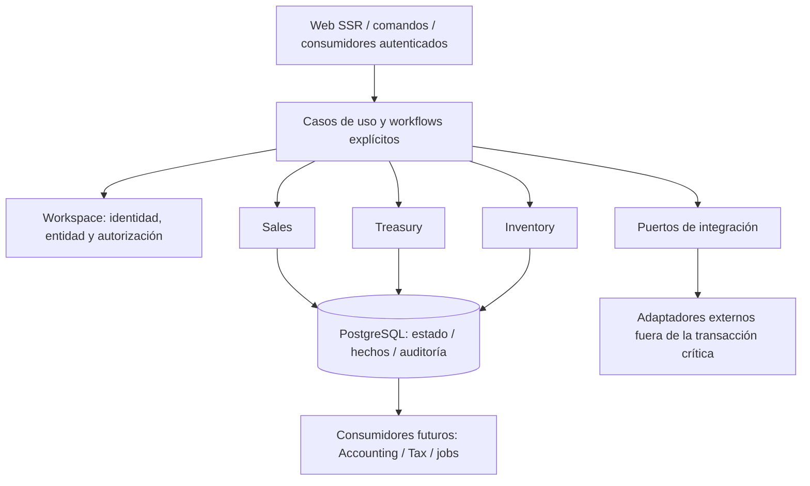

# Arquitectura general

Selección: monolito modular, un artefacto de aplicación y una base PostgreSQL. La unidad de despliegue no impide separar propietarios de datos ni verificar contratos. Motivo y alternativas: [ADR-001](../decisions/adr-001-modularity.md).

## Ocho principios

1. **Invariantes antes que automatización:** el dominio define el resultado permitido; una IA o una suite no lo inventa.
2. **Propiedad explícita:** cada hecho tiene módulo, entidad legal y origen; las proyecciones se identifican como derivadas.
3. **Transacción explícita:** quien coordina el flujo declara lecturas, recursos compartidos, bloqueos y efectos.
4. **Historia útil y corrección reversible:** hechos confirmados se compensan; datos transitorios pueden eliminarse conforme a política.
5. **Fronteras pequeñas y locales:** contratos públicos tipados; ORM interno y composición visible.
6. **PostgreSQL portable:** usar su integridad real sin convertir productos Supabase en parte del dominio.
7. **Evidencia proporcional y reutilizable:** verificar riesgo y alcance; una ejecución puede alimentar varios informes.
8. **Una fuente por afirmación:** spec, ADR, software, evidencia y release tienen autoridades distintas.

## Composición



El diagrama muestra responsabilidades, no paquetes existentes. Ningún worker ni módulo está implementado.

El [programa maestro](../roadmap/program.md) extiende esta composición a Procurement/P2P, Documents, Corporate, Accounting y Tax. Los módulos operativos publican hechos neutrales; Accounting interpreta y Tax concilia sin llamadas de retorno. Corporate conserva ownership conceptual sin exigir todavía una aplicación. El diagrama sigue mostrando la forma de coordinación, no el inventario completo de capabilities.

Un flujo que solo afecta a un módulo vive en su aplicación. Un flujo transversal tiene un coordinador nombrado, por ejemplo entrega o devolución, en workflows. El coordinador no vuelve a calcular reglas privadas: solicita decisiones y cambios a los propietarios mediante contratos. No existe un CommandBus genérico ni un registro mutable de callbacks.

## Estructura futura, no materializada

Nuevo amendment post-freeze: [Marketing Content / Media Library](../specs/flows/marketing-content-media-library.md) añade un pequeño dueño lógico para contenido/campañas y usos/publicaciones, sobre Documents/Catalog/Access/Audit. [Mapa canónico](boundaries.md#marketing-content) distingue negocio, custodia y transporte futuro; no modifica el monolito ni crea código. Revisión independiente pendiente según review.

```text
src/caspro/
  config/                 composición y settings
  shared/                 tipos pequeños y mecanismos sin negocio
  modules/<owner>/
    api.py                entrada pública pequeña
    types.py              contratos de datos cuando haga falta
    application/          casos de uso; archivo simple en módulos pequeños
    policies.py           cálculo/reglas puras, si existen
    queries.py            consultas internas
    models.py, migrations/
  workflows/              operaciones que coordinan varios propietarios
  integrations/           adaptadores externos
  web/                    HTTP, forms y templates por funcionalidad
tests/                    categorías definidas en calidad
```

No crear carpetas vacías ni clases espejo de Django. Los nombres finales se deciden al especificar el primer caso. No se exige RepositoryInterface, DTOFactory, EventBus ni un framework propio.

Separar código no basta: la [matriz de dependencias](boundaries.md), los [contratos transaccionales](transactions.md) y la [política de datos](data.md) determinan si la estructura aporta una garantía real.

## Diferencia sustancial respecto de V1

La nueva frontera se apoya en coordinación explícita, protección de lectura empresarial en DB, contratos sin objetos ORM, dinero neto reversible y QA por conjunto de evidencia. Crear otro services.py gigante o una red de resolutores constituiría incumplimiento del diseño aunque la carpeta se llamase CasPro.
