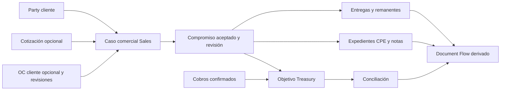

# Incremento B2B — compromiso y expediente comercial

Owner: Sales; Inventory, Treasury y Documents mantienen sus hechos. **Propuesta del amendment semántico post-freeze, pendiente de revisión independiente.** Baseline y alcance: [expediente](../../evidence/b2b-financing-amendment.md). Sin implementación ni WO. Extiende Sales, no crea un segundo circuito monetario o de stock.

## E. Alcance y secuencia

Venta nacional de bienes existentes a una Party cliente, incluida ORGANIZATION. Reutiliza [SP2](sales-stock-treasury.md), [CPE](cpe-document-delivery.md), [CM0](../cross-cutting/command-matrix.md#cm0) y [hechos](../cross-cutting/economic-facts.md). M04 conserva su primera venta B2C por Jumpseller; este incremento admite captura comercial directa sin inventar conexión, pedido remoto ni cliente duplicado. No amplía servicios vendidos, exportación, contratación pública especializada, CRM, licitaciones ni portal de clientes.

Aristas representan relaciones, no orden fiscal obligatorio. Anticipo o CPE pueden preceder a OC y aceptación. La adquisición/emisión externa de CPE sigue su oportunidad normativa; CasPro no emite ni transmite a SUNAT. «Expediente completo» significa hechos y pendientes explicables según la variante, no exigir un archivo para cada nodo ni afirmar cumplimiento por un grafo verde.

## F. Cotización y OC del cliente

La solicitud comercial es un caso Sales con identidad local, entidad, cliente candidato, procedencia y referencias del comprador. Recepción, resolución de identidad/mapping y decisión de aceptación son dimensiones distintas. Una cotización opcional pertenece a Sales: número propio, revisiones, cliente, moneda, líneas, precios/descuentos/componentes, vigencia, condiciones, destino y autor/aprobación. Emitir una propuesta comercial no reserva stock ni acredita conformidad del cliente. Documents conserva su representación; si se envía, su entrega es un hecho separado. Vencida o reemplazada no se adopta silenciosamente: nueva revisión/conformidad explícita.

La **Customer Purchase Order recibida** es evidencia comercial de Sales. La **Purchase Order emitida por TILMUX al proveedor** pertenece a Procurement. Comparten primitives Documents, nunca raíz, numeración, estado de aprobación ni tablas de negocio por llamarse ambas OC.

| Información de la OC | Contrato conceptual |
|---|---|
| Identidad local y externa | ID Sales estable por entidad; Party emisor/cliente y número externo exacto, fecha, procedencia y ámbito/serie del comprador si existe. El número solo nunca es único global. Misma referencia en clientes distintos es válida; colisión dentro del mismo emisor exige resolver documento nuevo, copia o revisión, no fusionar por heurística |
| Partes y referencias | Cliente comprador, emisor observado si actúa en su nombre, destinatario TILMUX, contacto/área, referencia del comprador, proyecto/centro de costo cuando consten; representación pendiente visible. Contacto no reemplaza Party ni prueba facultades |
| Condiciones | Fecha, moneda, destino/dirección, forma/plazos de pago, términos de entrega/aceptación, condiciones adicionales tal como constan. Ausencia se conserva; no inventar precio, impuesto, plazo o moneda a partir de un total |
| Líneas | Identidad fuente u ordinal estable en revisión, descripción/código comprador, cantidades/unidades y precios/componentes si figuran; correspondencia a SKU/unidad Catalog revisada. Una línea no resuelta bloquea aceptar esa propuesta íntegra |
| Original y extracción | Documents posee bytes/version/hash, origen, archivo original o copia explícita, cuarentena y accesos. Sales conserva campos interpretados, referencias exactas a versión/línea, parser/actor, confianza y decisión humana. Parsing nunca acepta términos ni ejecuta instrucciones del archivo |
| Revisiones | Cada recepción relevante conserva versión externa declarada y revisión local monotónica; fecha externa no ordena por sí sola. Copia repetida no crea nueva obligación. Cancelación/reemplazo externo observado conserva original y abre evaluación comercial |
| Conformidad | Actor, fecha de revisión, diferencias por línea/condición, aceptación o rechazo razonados, evidencia de lo acordado con el cliente y versión aceptada. «Revisado» no equivale a «aceptado» ni a autenticidad certificada |

Identidad, cantidad, unidad, precio o condición ambiguos mantienen el caso pendiente. Coincidir por monto, nombre, email u OCR no demuestra correspondencia. OC dirigida a otra entidad no se vincula como compromiso propio; evidencia puede conservarse según acceso y motivo sin aceptar la venta.

## Compromiso aceptado y asignaciones

Sales Order es el pedido/venta existente con revisión aceptada; no una nueva clase paralela por ser B2B. Snapshot: cliente/identidad utilizada, líneas y unidades, precios/descuentos/base/impuestos observados, moneda, destino, condiciones de pago/entrega, aprobación y fuentes seleccionadas. Identidad del caso local es distinta de la OC y de la venta; permite venta sin OC, varias revisiones recibidas y CPE previo a aceptación.

Cada vínculo aprobado identifica revisión OC + línea fuente → revisión/línea de venta, cantidad/unidad y componente monetario cuando sea comparable. Relaciones N:M controladas permiten varias OCs de un mismo cliente en una venta o una OC distribuida en varios compromisos; una OC revisada no vuelve a habilitar cantidades ya comprometidas. Se conserva una identidad de línea lógica y su linaje entre revisiones; sin correspondencia inequívoca se exige revisión humana. No se suman revisiones sucesivas como demanda adicional. Todos los pedidos afectados participan en el control de remanentes.

Demanda vigente de una línea OC, compromisos vigentes y remanente por aceptar se explican por separado. Cantidad asignada activa acumulada no excede la demanda acordada; devoluciones no reponen automáticamente derecho a aceptar otra venta contra la misma OC. Ampliación requiere demanda/revisión y decisión explícitas. Cuando falta precio en OC, se documenta la base comercial acordada; no se valida por igualdad monetaria ficticia.

Si la OC pide 100 y TILMUX ofrece 80, guardar 100 observado, 80 acordado y 20 no aceptado; motivo y evidencia de conformidad/contrapropuesta resuelta. Una aprobación interna sola no acredita que el cliente aceptó términos distintos. Sin evidencia suficiente, no afirmar acuerdo bilateral: caso pendiente. No cambiar la OC original para hacerla coincidir.

Aceptar la revisión B2B coordina, en una transacción, compromiso Sales, asignaciones OC, reserva íntegra Inventory del compromiso aceptado y objetivo Treasury; idempotencia y auditoría/hechos son atómicos. Reutiliza las guardas de C14 sin fingir un pedido Jumpseller: mismo pedido y mismos contratos de participantes, entrada local con identidad propia. No se llama C14 con una conexión ficticia. Sin stock suficiente no se confirma esa revisión, queda propuesta pendiente; puede acordarse una cantidad menor mediante otra revisión. Prometer abastecimiento futuro sin reserva requiere expansión posterior bajo D03.

Concurrencia: heredar orden CM0, descubrir K de destinos integrados antes de maestros/raíces; todas las raíces Sales/OC del caso participan en S/O30, luego T, reservas/posiciones y Documents según el efecto. Creación se protege por identidad natural/UNIQUE bajo I; no se bloquea una inexistencia. Releer demanda, asignaciones, revisión, políticas y stock antes de commit. Cambio del conjunto exige rollback/redescubrimiento. No llamadas a Treasury/Inventory desde modelos Sales, ni I/O bajo locks.

## H. Tipo de cliente y condiciones de pago

Party ORGANIZATION no concede crédito. Las condiciones del compromiso son snapshot Sales con política/version/aprobador, moneda, importe exigible, vencimiento o regla contractual conocida, hitos y evidencia. Etiquetas «prepago», «contraentrega» o «crédito» explican modalidades conceptuales; no fijan enums de implementación ni crean un motor financiero configurable.

| Variante | Resultado en este incremento |
|---|---|
| B2B sin cotización ni OC | Permitida con acuerdo comercial trazable y datos completos; ausencia de documento opcional visible |
| Cotización → OC, u OC directa | Se revisan términos y diferencias antes de aceptar; cotización no es requisito universal |
| OC sin crédito / B2B prepago | Modalidad inicial: pago íntegro confirmado y aplicado al objetivo vigente antes de **cualquier** despacho, incluso parcial; conserva el control HP1 |
| Pago previo a OC/venta | Treasury registra dinero real como anticipo/no aplicado, con Party identificada si se conoce; aplicación posterior expresa y acotada. Fiscalidad del anticipo no espera la OC |
| Pago parcial | Se conserva y muestra pendiente; no autoriza entrega proporcional ni crea crédito implícito |
| Contraentrega o crédito comercial | Representable como condición solicitada, **no elegible para aceptación/dispatch bajo política inicial**. D03 exige encargo, política comercial aprobada y spec de vencimientos, límites, riesgo/cobranza, parciales, mora y coordinación antes de habilitar el efecto. La aprobación no se infiere del texto de la OC |

No se exige dictamen profesional para revisar cantidades o aceptar una propuesta comercial ordinaria. C07/C08 se aplican a los efectos fiscales pertinentes; crédito futuro exige decisiones concretas de riesgo y evidencia, no retrasar B2B prepago por construir AR enterprise.

## Parcialidades, CPE y correcciones

Cada entrega consume remanente de línea aceptada y reserva bajo SP2; conserva destino, recepción/conformidad y evidencia física/traslado aplicable. Varios CPE legítimos por venta siguen asignaciones documentales de C33, anticipos deducidos, notas y cobertura sin duplicación. No se emite un CPE nuevo por cada parcialidad por automatismo. La referencia OC del CPE se contrasta con la revisión/asignación comercial; discrepancia → MISMATCH/revisión, no cambio del original ni confirmación por monto. Un CPE que agrupa varias ventas continúa fuera del vínculo automático del alcance actual.

Revisión OC posterior a aceptación mantiene la revisión aceptada y abre discrepancia; no modifica precio, reserva, objetivo ni CPE. Resolverla exige declarar efectos por dueño: mantener acuerdo anterior con sustento, ajustar remanentes o preparar nuevo compromiso. Una adición no se ejecuta como edición del webhook/archivo.

Cancelación tras despacho parcial solo cancela remanente no ejecutado; conserva entrega, obligación ajustada, liberación de reserva pertinente y regularización de aplicaciones excedentes en el mismo flujo. CPE/nota, refund y retorno físico son decisiones distintas. Retorno referencia entrega original, cantidades netas y stock inicialmente no vendible conforme SP2; no borra una venta confirmada. Correcciones preservan WHO/WHAT/WHEN/SOURCE/WHY/VERSION, fecha del hecho y registro.

## G. Expediente y navegación

Ancla Sales con cliente, propuesta/cotización opcional, OCs y diferencias, revisión aceptada, aprobaciones, condiciones de pago, reservas, entregas/parciales, traslado, CPE/notas, historia de entrega documental, cobros/aplicaciones, conciliación y auditoría. Cada relación tiene tipo, origen y dueño; listas y drill-through funcionan sin grafo. La consulta devuelve cortes y pendientes por dueño, no un estado «todo completado» que esconda conciliación o disputa.

Document Flow proyecta relaciones autorizadas. No posee deuda, cumplimiento fiscal, dinero, stock ni estado de aceptación. Contactos, destinatarios y destinos conservan la versión usada; acceso filtra documentos, nodos y totales. Un documento ausente o ambiguo no es cero ni ausencia de obligación.

## Contratos de acción y validación posterior

Capturar/revisar OC o cotización exige capacidad Sales específica y revisión esperada; subida/preview exige Documents. Aceptar exige Sales, reserva Inventory y publicación de objetivo Treasury por coordinador autorizado; la firma o aprobación comercial se conserva como evidencia, no como permiso de aplicación. Corregir usa capacidades existentes del dueño afectado, motivo, revisión y comando completo. No se conceden permisos por ser administrador técnico.

Hechos candidatos: propuesta/cotización revisada (comercial), OC recibida/revisada (evidencia), compromiso aceptado/ajustado y entregas/retornos (económicos cuando corresponda). El envelope conserva fuentes/revisiones y causación; una OC o cotización sola no produce reconocimiento Accounting ni objetivo Treasury. Lecturas no confirman acciones. Reintento idéntico devuelve el mismo resultado; clave con inputs distintos o revisión obsoleta produce conflicto, sin efectos parciales.

Aceptación documental: casos 1–15 del [expediente adversarial](../../evidence/b2b-financing-amendment.md#v-37-casos-adversariales). Implementación posterior requiere B02–05/B09/B10, pruebas de asignación OC N:M concurrente y no duplicación entre revisiones, stock/cobro/retorno y CPE existentes. Gates reales C03/C05/C07/C08/C13 por efecto; ningún check documental los cierra.
